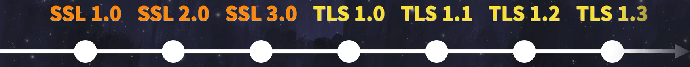
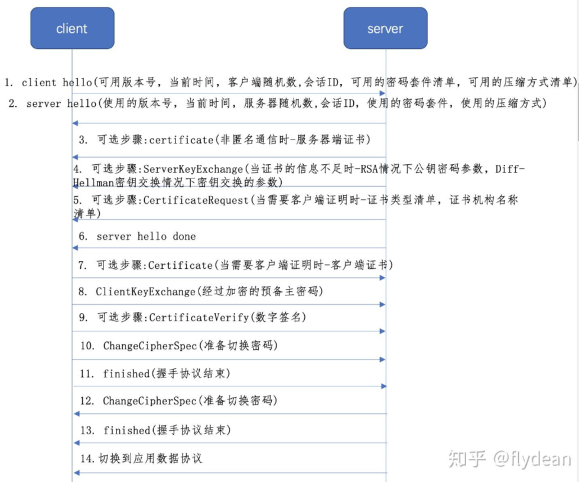

---

#博客文件名： 2512-TlsProcessAnalysis.md
title: TLS协议流程解析  
publishDate: 2025-12-06 22:41:00  
description: '细讲TLS协议建立通讯的每一步都做了啥。'  
tags: [协议, TLS]  
heroImage: { src: './2512-TlsProcessAnalysis-banner.jpg', color: '#388cfaff' }  
language: '中文'

---

TLS全名为传输层安全协议（Transport Layer Security），它是SSL标准化升级版本，现在提到的SSL/TLS一般默认为TLS协议，协议过程中使用的证书是与SSL同类的数字证书（X.509数字证书）。

## SSL和TLS差别

SSL由于握手过程相对简单，同时SSL的证书通常使用自签名证书或者已知的密钥，证书的管理也比较松散，加密算法依赖旧的加密算法。

随着计算机算力的增强，旧的加密算法已经能被计算机短时间内暴力破解，所以去除当前不安全的加密算法以及使用规范流程的升级算法TLS出现了，SSL1.0迭代到SSL3.0后就停止更新，切换为了TLS1.0。

强制使用更安全的算法，这里安全的重点是密码的长度😎，讲究是一大力出奇迹。

早期比如DES密钥长度56位，如果暴力破解最长要256次尝试，现代计算机分分钟就破解了；而现在比如AES-256密钥长度达256位，暴力破解要2256次尝试，截至25年还未有能直接破解。

对于证书的管理更为严格，所有证书必须要经过CA（证书的权威认证机构），在验证证书时直接CA机构认证更为透明。

到这里小伙伴发问了：“咋不直接命名SSL 4.0捏？”，当时SSL2.0、SSL3.0由于弱加密算法还有其它安全机制的缺陷，容易受到中间人攻击被使用的用户质疑其安全性，所以大刀阔斧的标准化了流程和增强了加密算法，并且避开了名声受损的SSL名，重开了TLS以表决心。

## 为什么要使用TLS/SSL协议

早期互联网上传输信息是直接明文发送信息，通过对方联网的IP地址发送到指定的电脑中，这样的风险是只要有个中间人冒名顶替了接收者的IP地址，或者更朴素的是监听了这人网线发出来的消息，那通话内容就被扒光了，甚至攻击人可以虚拟你的IP地址向其他人发送信息。

所以这套协议主要是在建立通讯之前使用安全的方式，相互验证身份以及沟通好加密密钥，进行加密通话，防止第三人冒名顶替或窃听通话内容。

之前web网页一般都是 `HTTP://.......` 这样的网址，标志着它是最为原始的明文http协议，比如上网淘宝购物，付款时的账号密码都是明文在互联网中传输，有心人能轻而易举的捕获信息并获取账号密码，实在危险。

现在的互联网环境开始强制使用HTTPS协议，后面这个S指代最初的SSL传输协议，现在基本为TLS协议，为的就是在建立通讯的时候互相严明通讯双方的身份是否正常，然后商量加密的方式是什么后，开启加密通讯，这样即使有心人捕捉到了信息也无法解密通讯内容。

现在需要使用的场景有很多，比如：

1. Web安全（HTTPS）

    1. 浏览器与网站服务器之间的数据传输（如登录、支付、个人信息提交）。
2. 电子邮件安全（SMTP/IMAP/POP3 over TLS）

    1. 邮件客户端与服务器之间的通信。
3. 即时通讯（IM）与API通信

    1. 微信、WhatsApp等聊天应用，或APP与服务器间的API调用。
4. 物联网（IoT）设备安全

    1. 智能设备（如摄像头、传感器）与云端服务器的通信。
5. 文件传输（FTP/SFTP）

    1. 通过FTP或SFTP协议上传/下载文件

## 一点点信息补充

> HTTP 默认端口：80。	HTTPS 默认端口：443。
>
> SSL 证书相当于驾驶证，是保存在源服务器的数据文件。需要向 CA 证书授权中心申请证书。
>
> 证书可以表明：（用户安装了 SSL 证书之后就可以通过 HTTPS 访问服务器）
>
> - 域名属于谁
> - 申请日期
> - 其他信息
> - **公钥**
> - **私钥**
>
> TLS 是 SSL 的后续版本，是一种对数据加密的框架。
>
> 

私钥加密的文件只能用公钥解开，公钥加密的文件只能用私钥解开。

TLS1.2 中使用的两种加密形式：

- RSA（非对称加密算法）

  - 服务器有自己固定是私钥和公钥。把公钥散播出去，要和服务端通信需要通过公钥加密随机数生成预主密钥发给服务端，在通过预主密钥计算生成会话密钥，以此进行本次的数据加密沟通。
  - 缺点：一旦私钥被破解了，之前所有的数据通信都将被解密。
- DH（服务端有自己固定的公钥和私钥）

  - 客户端请求连接的时候，服务端把自己固定公钥发送给客户端，客户端也生成一对公钥和私钥，在把自己的公钥发送给服务端。
  - 它们连接的对称密钥是使用自己密钥和对方发送的公钥基于公开的算法算出一个密钥。双方算出的密钥都是一样的，所以可以作为后续通信加密使用对称加密密钥。
  - 缺点：由于服务端的公钥是固定的，只有客户端的公钥是临时随机生成发，被破解的可能性也比较大（TLS1.3 废弃了，使用了 DHE 算法，双方每次通信的公钥和私钥都是随机生成的）。

## TLS1.2 的 RSA 握手过程

> 在原先的 TCP3 次握手上进行改进。
>
> 
>
> 

开始解析握手过程：

​`客户端`​ ​1 和 `服务端`​ ​2 步骤是用来对照双方使用的版本号和使用的密码套件以及压缩方式，并各自生成了一个随机数发送给对方，分别为**随机数一**、**随机数二**。

> 以上相互声明完毕后，服务端先发送请求。

3. ​`服务端` ​服务器向客户端出示自己的证书，让客户端对照自己的证书信任列表类确认这个服务器是否可靠。
4. ​`服务端` ​ServerKeyExchange 这一步服务器把自己公钥发送给了客户端。
5. ​`服务端` ​如果服务端也要客户端的证书，会发送 CertificateRequest 请求包。比如登入网银就要这个步骤了，可省略。
6. ​`服务端` ​最后还要发送一个 ServerHelloDone 包表示结束

> 接下来客户端进行响应。

7. ​`客户端` ​Certificate 包，当服务端执行了连接的第五步，发送了 CertificateRequest 请求包，客户端就要在此时反馈自己的客户端 SSL 证书。
8. ​`客户端`​ ​ClientKeyExchange 包，生成一组随机数，在通过会服务器发送的公钥进行加密发送给服务器，称为预备主密码（服务端使用自己的私钥解密，得到预备主密码），这是**第三个随机数**。
9. ​`客户端` ​发送数字签名，证明自己是证书的持有者。
10. ​`客户端` ​告诉服务器往后的数据就用商议好的算法和密钥来加密，准备切换加密通信。
11. ​`客户端` ​发送 EncryptedHandshakeMessage 包，表示客户端加密开始。

> 服务端也开始回应。

12. ​`服务端` ​告诉客户端往后的数据就用商议好的算法和密钥来加密，准备切换加密通信。
13. ​`服务端` ​发送 EncryptedHandshakeMessage 包，表示服务端加密开始。

> ★ 到此，握手过程结束，从现在开始的数据都是**通过加密**进行通信的。

接下来用来加密数据的密钥为：`随机数一 + 随机数二 + 随机数3（预备主密钥）= 会话密钥`

这里的预备主密钥只有客户端和服务端知道，而且每次建立通讯都会重新生成随机数计算出会话密钥，安全性会大大增强。后面都是用对称性加密进行通讯了。

## 参考

> 1. [HTTPS 是什么？加密原理和证书。SSL/TLS 握手过程_哔哩哔哩_bilibili](https://www.bilibili.com/video/BV1KY411x7Jp/?spm_id_from=333.788&vd_source=58197a5b8611da761d73750a6086f2fd)
> 2. [一篇文章让你彻底弄懂SSL/TLS协议](https://zhuanlan.zhihu.com/p/133375078)

‍
