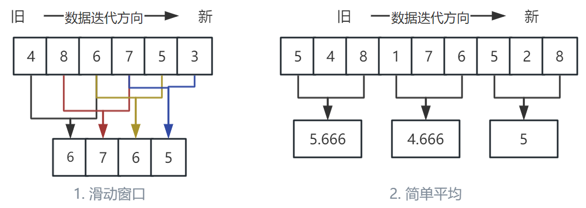
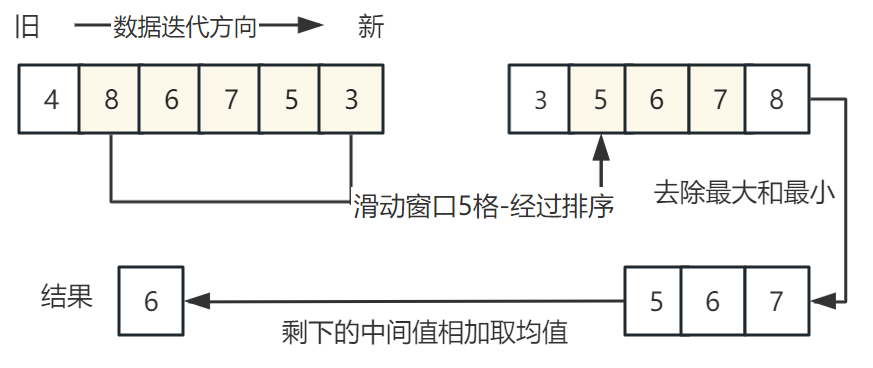
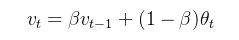

---

title: 单片机中5种常见简单滤波器  
publishDate: 2025-12-25 22:37:00  
description: '单片机简单滤波器思路解析，附带使用代码。'  
tags: [算法, 滤波]  
heroImage: { src: './McuSimpleFilter_banner.jpg', color: '#0c2638ff' }  
language: '中文'

---

## 前言

MCU开发过程中采集各类数据，无论是简单的温度、电压、电流，甚至是摄像头传出来的图像数据，多少都会受到电路噪声、环境噪声的影响，导致被噪声影响的数据触发了功能操作。

所以工程师们对于采集到的数据要有一定的敏感度，不能拿来就用。这时常见的滤波器就能对收集到的数据进行处理，过滤平滑收集的数据，防止被噪声影响。

前三者滤波器主打大力出奇迹，在连续的多点数据中得到想要的数据，使用均值或中位值的方式，抑制数据的波动，以达到平滑的效果；缺点也很明显，使用连续多点处理得出数据，会导致数据滞后，窗口越大，滞后性越强。

后两者则是数据迭代的思想，每次结果的都是依靠上次滤波器的结果和本次输入值，经过权重分配输出结果。

> 本文提供代码仅供思路参考，实际使用请根据项目适配！具体效果差异请自己尝试方可知道对数据的影响，这里只讲思路。

## 一、滑动平均滤波器

思路：取固定长度的窗口，对连续的数据相加，取均值。

缺点：不适合脉冲干扰比较严重的场合，灵敏度低，滞后性较强。

这是简单，计算速度最快的滤波器，<u>在数据上下波动不是很大，并且不担心延迟的场景可使用。</u>

滑动的过程可以是连续的，也可以是片段的，这里根据实际使用场景自己决定。



算法中不一定要使用滑动窗口，在函数内使用静态变量计数并累加输入值，到指定计数值后计算均值，清除计数和累计的数据值重新计数，这在实际应用中更为常见。

```C
// 这里简单静态滑动窗口案例
#include <stdbool.h>

#define MOVING_AVG_BUF_SIZE 	(5) // 定义滑动窗口大小

typedef struct {
    float buf[MOVING_AVG_BUF_SIZE];    // 环形缓冲区存储历史数据
    float sum;     						// 缓冲区数据的总和
	int index;     						// 当前缓冲区位置
	bool buf_full;						// 缓冲区满了
} moving_avg_s;

// 初始化滑动平均滤波器
void moving_avg_init(moving_avg_s *filter) 
{
    filter->index = 0;
    filter->sum = 0.0f;
	filter->buf_full = false;
    for (int i = 0; i < MOVING_AVG_BUF_SIZE; i++) 
	{
        filter->buf[i] = 0.0f;
    }
}

// 更新滤波器并计算当前平均值
float moving_avg_updata(moving_avg_s *filter, float input) 
{
	int current_buf_size = MOVING_AVG_BUF_SIZE;

	if (!filter->buf_full)
	{
		current_buf_size = filter->index + 1;
	}

    // 减去即将被替换的旧数据（如果缓冲区已满）
    if (filter->buf_full) 
	{
        filter->sum -= filter->buffer[filter->index];
    }
	else if (current_buf_size >= MOVING_AVG_BUF_SIZE)
	{
		filter->buf_full = true;
	}

    // 添加新数据到缓冲区
    filter->buf[index] = input;
    filter->sum += input;
    filter->index = (filter->index + 1) % MOVING_AVG_BUF_SIZE;

    return filter->sum / current_buf_size ;
}
```

## 二、中位值滤波器

思路：取固定长度的窗口，对窗口内数据进行排序，取中位数。

缺点：每次都需要计算排序，影响性能；对快速的信号变化反应比较慢。

中位值滤波器去噪效果好，每次都是取连续数据的中值，这能有效的过滤异常数据，并保持信号的原始特征；在只需要过滤数据异常值的场景上很适用，<u>比如偶尔出现的一两个最大或最小的极值，这里能有效滤除。</u>

中值滤波不一定要使用滑动窗口，缓冲区累计数据到指定大小取中值，然后在清空缓冲区重新累计也是常见做法。


```C
// 这里简单静态滑动窗口案例
// 中位值滤波窗口至少要大于 3, 并且为奇数最佳
#include <stdbool.h>

#define MOVING_MEDIAN_BUF_SIZE 	(5) // 定义滑动窗口大小

typedef struct {
    int buf[MOVING_MEDIAN_AVG_BUF_SIZE];    // 环形缓冲区存储历史数据
	int index;     						// 当前缓冲区位置
	bool buf_full;						// 缓冲区满了
} moving_median_avg_s;

// 初始化滑动平均滤波器
void moving_median_init(moving_median_avg_s *filter) 
{
    filter->index = 0;
	filter->buf_full = false;
	memset(filter->buf, 0, sizeof(filter->buf));
}

// 更新滤波器并计算当前平均值
int moving_median_updata(moving_median_avg_s *filter, int input) 
{
	int result = 0;

	// 添加新数据到缓冲区
    filter->index = filter->index % MOVING_MEDIAN_AVG_BUF_SIZE;
    filter->buf[filter->index] = input;
    filter->index++;
    

	if (!filter->buf_full && filter->index >= MOVING_MEDIAN_AVG_BUF_SIZE)
	{
		filter->buf_full = true;
	}

    if (filter->buf_full) 
	{
        int arr[MOVING_MEDIAN_AVG_BUF_SIZE];
		memcpy(arr, filter->buf, sizeof(filter->buf));
		// 排序
		bubble_sort(arr, MOVING_MEDIAN_AVG_BUF_SIZE);
		// 取中间值
		result = arr[ MOVING_MEDIAN_AVG_BUF_SIZE/2];
    }
	else
	{
		result = input;
	}

    return result;
}
```

## 三、中位值平均滤波

思路：固定窗口取连续的几点，去掉最高的几个数据，去掉最低的几个数据，剩余数据取均值。

缺点：每次都需要计算排序比较消耗性能，在快速变化大的情况下会产生“阶梯效应”，因为均值时数据会受到旧小数据的影响，就出现阶梯的形状。

中位值平均滤波结合了中值滤波的过滤异常值，并且也结合了均值滤波的稳定数据，小窗口下还能多保留些细节，但数据变化较大时，变化曲线容易呈现阶梯状；<u>数据带有个别噪点，同时又在小幅度抖动，可使用本滤波器，</u>



代码上就是在中值滤波上增加了去除最大值和最小值，均值中间几点数据出结果；但如果小一维窗口可以更简单些，不用排序。

```C
// 这里简单静态滑动窗口案例
// 中位值平均滤波，这里案例是常用窗口5点，去除最大最小点，无需排序。
#include <stdbool.h>

#define MOVING_MEDIAN_AVG_BUF_SIZE 	(5) // 定义滑动窗口大小

typedef struct {
    int buf[MOVING_MEDIAN_AVG_BUF_SIZE];    // 环形缓冲区存储历史数据
	int index;     						// 当前缓冲区位置
	bool buf_full;						// 缓冲区满了
} moving_median_avg_s;

// 初始化滑动平均滤波器
void moving_median_init(moving_median_avg_s *filter) 
{
    filter->index = 0;
	filter->buf_full = false;
	memset(filter->buf, 0, sizeof(filter->buf));
}

// 更新滤波器并计算当前平均值
int moving_median_updata(moving_median_avg_s *filter, int input) 
{
	int result = 0;

	// 添加新数据到缓冲区
    filter->index = filter->index % MOVING_MEDIAN_AVG_BUF_SIZE;
    filter->buf[filter->index] = input;
    filter->index++;
    

	if (!filter->buf_full && filter->index >= MOVING_MEDIAN_AVG_BUF_SIZE)
	{
		filter->buf_full = true;
	}

    if (filter->buf_full) 
	{
        int max_vlue = filter->buf[0];
        int min_value = max_vlue;
        int sun = 0;

        for (int i = 1; i < MOVING_MEDIAN_AVG_BUF_SIZE; i++)
        {
            int vlue = filter->buf[i];
            if (vlue > max_vlue)
            {
                max_vlue = vlue;
            }
            
            if (vlue < min_value)
            {
                min_value = vlue;
            }

            sun += vlue;
        }

        result = sun / (MOVING_MEDIAN_AVG_BUF_SIZE - 2);
    }
	else
	{
		result = input;
	}

    return result;
}
```

## 四、指数加权移动平均滤波

指数加权移动平均滤波（EWMA），这一串名词蹦出来挺高大上的，其实没啥，先看其公式：



t表示当前时间；v为经过滤波器的数据；θ为当前输入值；β为权重系数，是两个数据在结果中所占的百分比。

这里定上一时间的结果权重40%，所以根据公式为：

- 滤波结果 t= 滤波结果t-1 * 0.3 + （1 - 0.3）* 输入数据t。

当然每次的滤波结果都需要记录下来不断更新，并应用到下次计算当中。

滤波后的数据会受到历史数据的影响不会跳动太大，能够反映出接下来数据变化的趋势，但由于受到旧数据的影响，整体趋势会有一定的滞后。（嚼碎了啊喂，请动动小脑袋好好理解一下）

思路：对历史结果乘固定百分比β，最新数据乘（1-β）的百分比，两者相加后得到输出值，并且输出值更新值历史结果用于下次计算；<u>*历史结果和最新数据所占的权重相加等于1*</u>。

它对数据平滑的效果无敌，但是过度平滑会导致数据失真，所以需要调整参数 β 来达到想要的效果。


留下作业：下方代码这样就够了嘛，如果使用在温度检测上，真实数据突然变得很大会有什么问题？有什么办法可以缓解因为温度骤升或骤降而失真延迟太大的问题。。。

```C
// 指数加权移动平均

#define EWMA_SMOOTH_ALPHA_EDGE 1.0f      // 边缘当前质心权重占比
#define EWMA_SMOOTH_ALPHA_SMOOTH 0.3f    //平滑后参数
#define EWMA_TRANSITION_STEPS_COUNT  3   //收敛速度

// 指数均值移动滤波对象
struct ewma_smoother_t
{
    float prev_smoothed_value;      // 存储上个值
    float alpha;                    // 权重
};

// 指数加权移动平均-------------------------------------------------------------
void ema_smoother_init(struct ewma_smoother_t *ewma)
{
    ewma->prev_smoothed_value = 0.0f;
    ewma->alpha = EWMA_SMOOTH_ALPHA_SMOOTH;
}

/**
 * 指数加权移动更新
*/
float ema_smoother_update(struct ewma_smoother_t *ewma, float current_value) 
{
    // 动态调整平滑系数
    if (ewma->alpha > EWMA_SMOOTH_ALPHA_SMOOTH)
    {   
        ewma->alpha -= ((EWMA_SMOOTH_ALPHA_EDGE - EWMA_SMOOTH_ALPHA_SMOOTH)
            * (1.0f / EWMA_TRANSITION_STEPS_COUNT));
    }
    else
    {
        ewma->alpha = EWMA_SMOOTH_ALPHA_SMOOTH;
    }

    ewma->prev_smoothed_value = ewma->alpha  * current_value + (1.0f - ewma->alpha ) * ewma->prev_smoothed_value;
    return ewma->prev_smoothed_value;
}
```

## 五、一维卡尔曼滤波器

经典卡尔曼滤波，这里先简单解释一下一维卡尔曼，后续在做专题仔细介绍。

思路：它是通过之前数据的测量误差预测下一数据的值，然后用这个值去修正测量出的下一数据，得出结果，并记更新测量误差用于下次计算，<u>本质是指数加权移动滤波(EWMA)加上更复杂的动态系统模型，进行更为系统化的动态权重计算</u>。

一维卡尔曼指定了固定的Q(过程噪声)和R(测量噪声)，Q反应了模型预测的误差，越高则表示模型越不可靠，预测值权重占比越低，反之亦然；R表示传感器测量的误差，越高表示测量噪声越大，测量值权重占比越低，反正亦然。

卡曼计算滤波计算流程如下图：


由于一维卡尔曼的F(状态转移矩阵)和H(观测矩阵)退化为标量1，因此只能滤波静态噪声，无法用于动态跟踪。

```C
//一维简单静态卡尔曼 

struct kalman_1d
{
    float x;  // 状态估计——滤波结果
    float p;  // 估计协方差

    float q;  // 过程噪声——模型不确定性
    float r;  // 测量噪声——传感器噪声
};

// 卡尔曼滤波器
void kalman1d_init(struct kalman_1d * kf, float init_x, float init_p, float init_q, float init_r)
{
    kf->x = init_x; 
    kf->p = init_p; 

    kf->q = init_q;
    kf->r = init_r;
}

/**
 * 卡尔曼滤波器更新
*/
float kalman1d_update(struct kalman_1d * kf, float x)
{
    // 预测
    kf->p = kf->p + kf->q;
    // 更新
    float K = kf->p / (kf->p + kf->r);  // 增益
    kf->x = kf->x + K * (x - kf->x);    // 状态更新
    kf->p = (1.0f - K) * kf->p;            // 协方差更新

    return kf->x;
}
```

## 结语

以上是一些基础的平滑滤波算法，掌握其思想，在程序上才能保证采集数据的稳定。

本文非AI创作，如转载请注明出处。

‍
