---

# 博客文件名： 260422-McuReverseEngineeringTest  
title: MCU固件逆向工程测试  
publishDate: 2026-04-22 12:00:00  
description: '读取MCU固件进行反编译破解，警醒要关注固件安全。'  
tags: [固件安全]  
heroImage: { src: './260422-McuReverseEngineeringTest-banner.jpg', color: 'rgb(8, 46, 90)' }  
# color: '#3a8047'
language: '中文'

---

## 一、前言

兄弟们不知道有没有担心过自己程序被破解这件事。

大家都抱有侥幸心理，觉得一个bin文件或者hex文件以二进制格式存在，打开又看不懂，有什么担心的；更何况那些已经烧录进单片机中，哪有人闲着没事干去读取，看又看不懂。

这是对自己劳动成果的不负责，只要产品量大了，总有白嫖的人，直接用Jlink读取单片机固件，抄板烧录，都省得开发了。

更有甚者，反编译固件，提取固件中的一些密钥等数据，研究公司的核心算法，这不直接完蛋。

再这提醒各位同仁一定要对MCU的固件进行加密，至少别随便来个人就能简简单单得到固件。

## 二、从MCU读取固件

这里使用ARM Cortex-M3内核的STM32F103CB进行逆向工程的牛刀小试。

### 1、前期准备

首先J-link相信各位工程师手上都有一个，没有就淘宝买一个，或者STM32系列的用ST-Link也行。  
​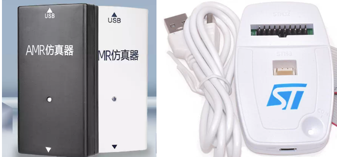

接下来以J-link为例子，配合J-link的上位机软件，自己去官网下载：[SEGGER - The Embedded Experts - Downloads - J-Link / J-Trace](https://www.segger.com/downloads/jlink/)

这里我直接选择最新的。

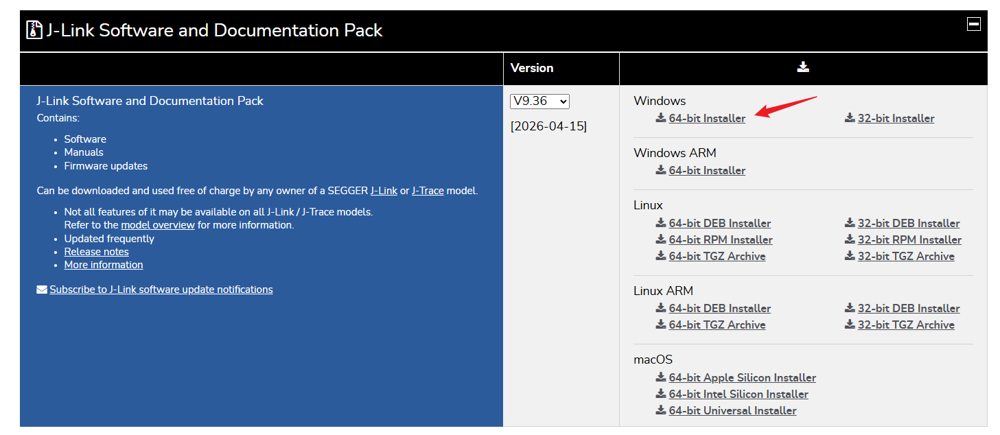

### 2、读取固件

软件安装结束后，打开J-Flash，并创建工程

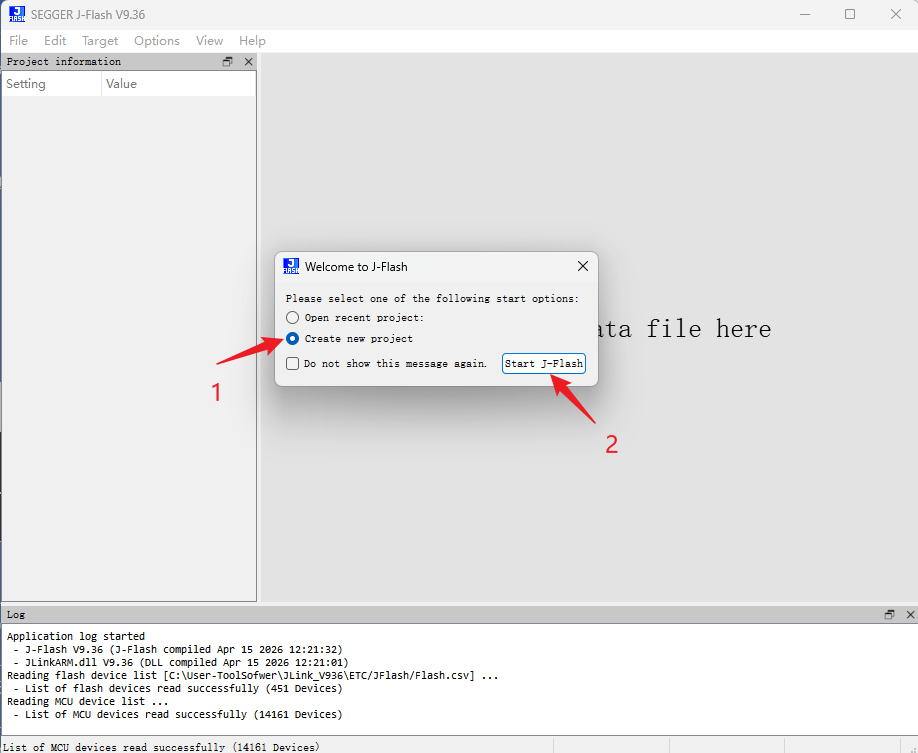

选择你使用的芯片，创建工程。

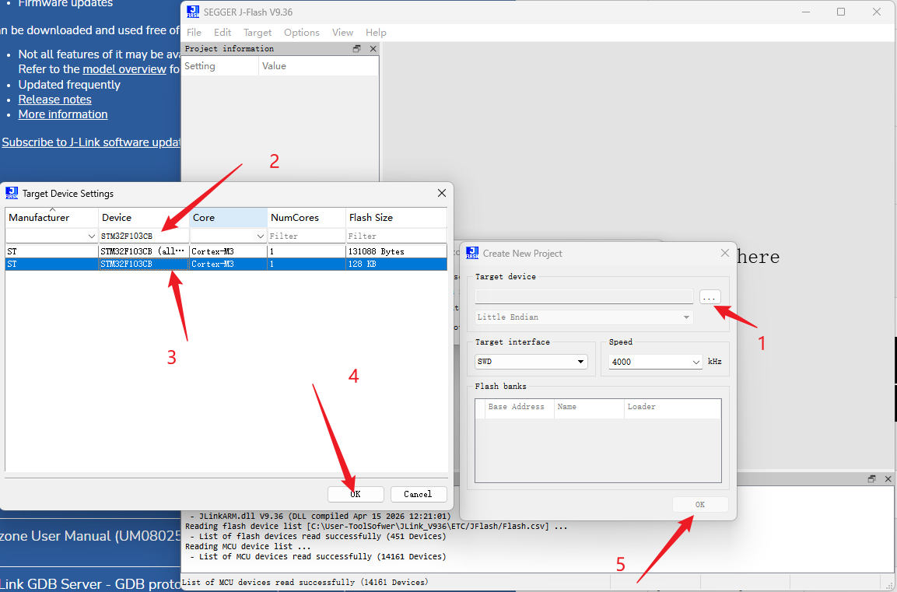

接下来把芯片连接到Jlink上，我使用的是SWD连接。  
物理连接上后在软件点击连接，这里要确认芯片使用的对不对。

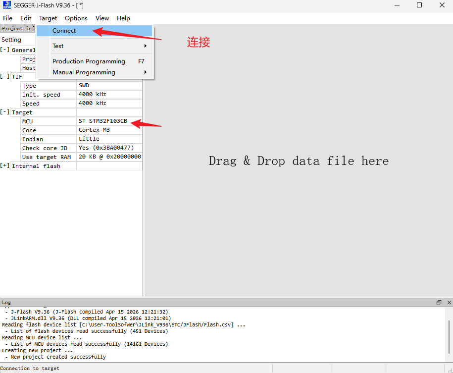

点击后可以看到日志显示连接成功：  
​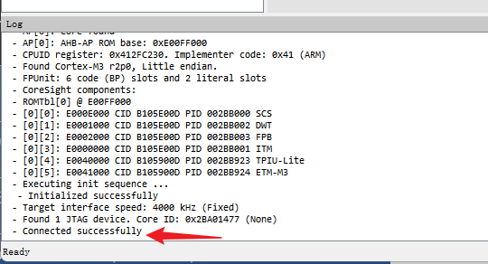

接下来紧张刺激的来了，如果对方没有设置RDP等级，一键就能取出MCU的固件。

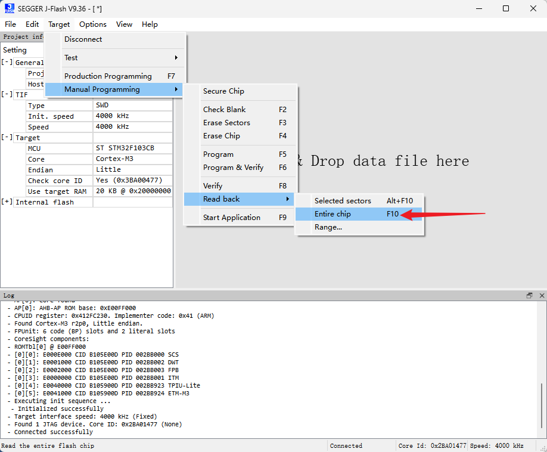

取出整个flash内容成功。

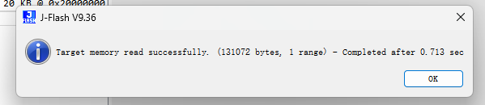

取出后保存成文件，可自行选择bin/hex文件。

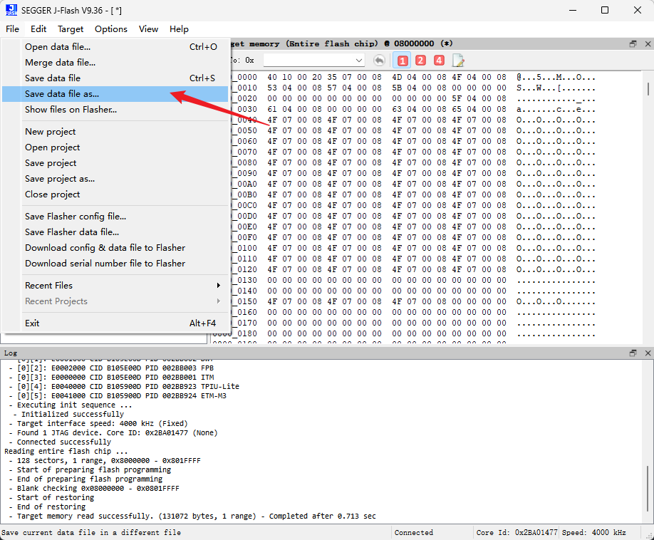

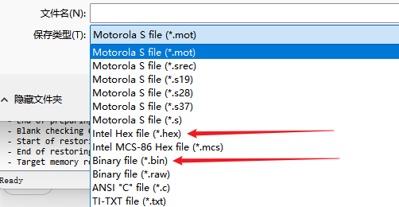

至此，保存出来的固件直接烧录到硬件中就可使用了，对手在花个半天时间抄板，直接就能用读取出来的固件上线。

## 三、反编译固件

简单的展示一下流程。

### 1、软件

自行下载IDA pro：[IDA Pro: Powerful Disassembler, Decompiler & Debugger](https://hex-rays.com/ida-pro)

官网要上去是要有点魔法，网上教程资源多的很，自行找资源哦。

IDA Pro是专业是交互式反汇编器，是目前很常用的逆向工具。

这里我选用：IDA Professional 9.2。

### 2、反编译

打开软件，创建新的工程，**新工程选择我们要反编译的固件**。

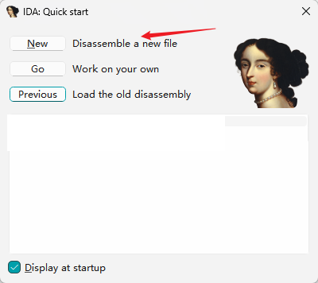

由于STM32F103CB是ARM内核的小端字节序，所以字节序选择小端；加载文件格式选择Binary文件。

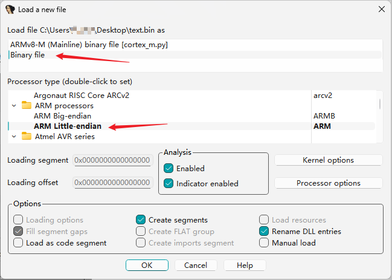

接下来设置处理器的架构，这里要根据使用的芯片进行选择。  
由于本实验使用的STM32F103CB是M3内核，为ARMv7-M，使用的Thumb-2指令集，这里不要设置错了。

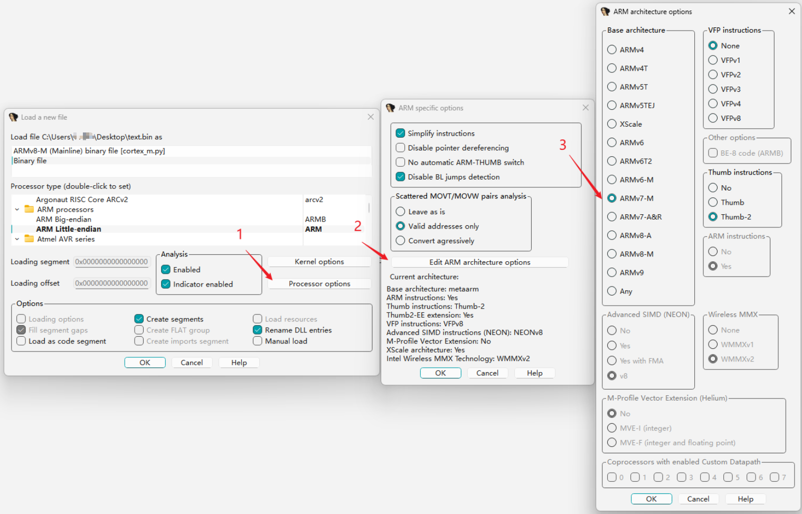

设置ROM的起始地址、读取地址，以及读取长度。

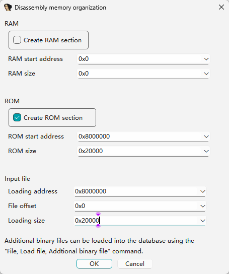

反编译成功

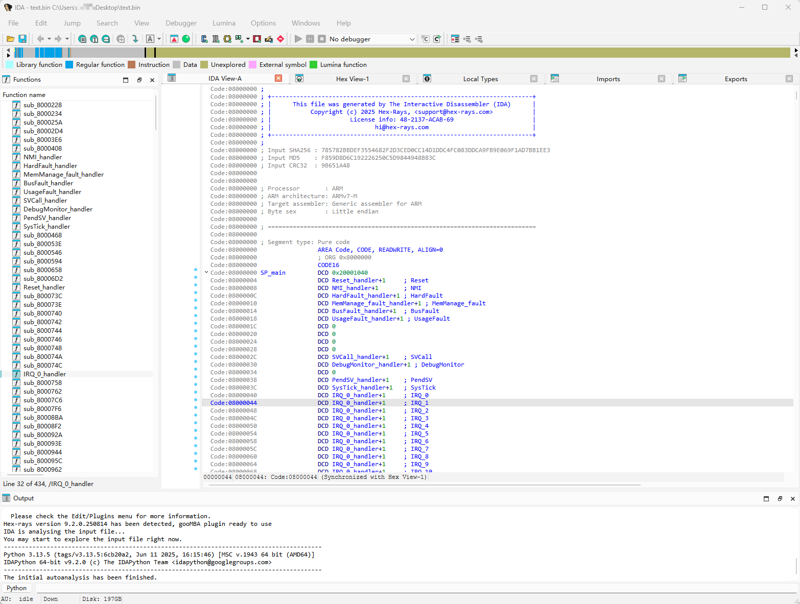

我第一次到这里时，极为震惊，没有想到竟然有这么容易。。。

### 3、分析程序

> IDA pro教程：[IDA详细使用教程，适合逆向新手的实验报告_ida 使用方法-CSDN博客](https://blog.csdn.net/qq_53058639/article/details/136249575)
>
> 分析程序前稍微知道一下一些快捷键：
>
> 1. 空格键：反汇编窗口切换文本跟图形
> 2. Esc：在反汇编窗口中使用为后退到上个操作的地址处
> 3. ALT+T：搜索字符串(文本搜索)
> 4. F5：将一个函数逆向出来(生成c伪代码)

上电从复位向量开始执行的，所以一路从复位向量开始双击进入，跟踪每一小块的跳转地址，就可找到主函数。

这里也可以按空格键后，使用可视化图形进行跟踪。

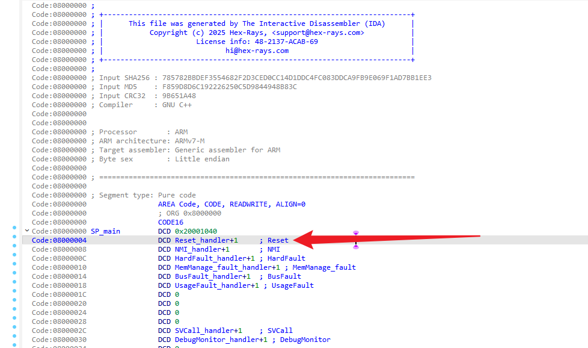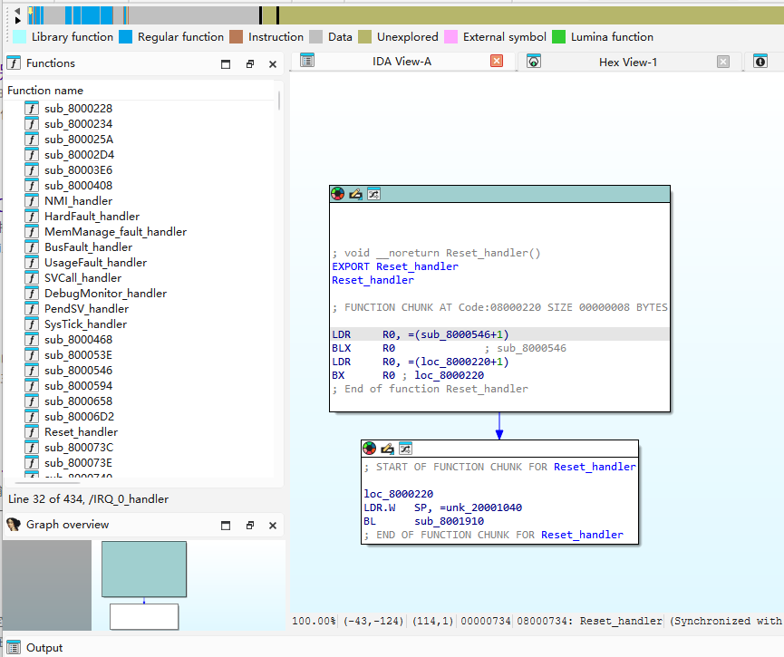

一路跟踪到第一大段汇编。

这里的经验是根据STM32F103而来，不同的程序请自己查找。

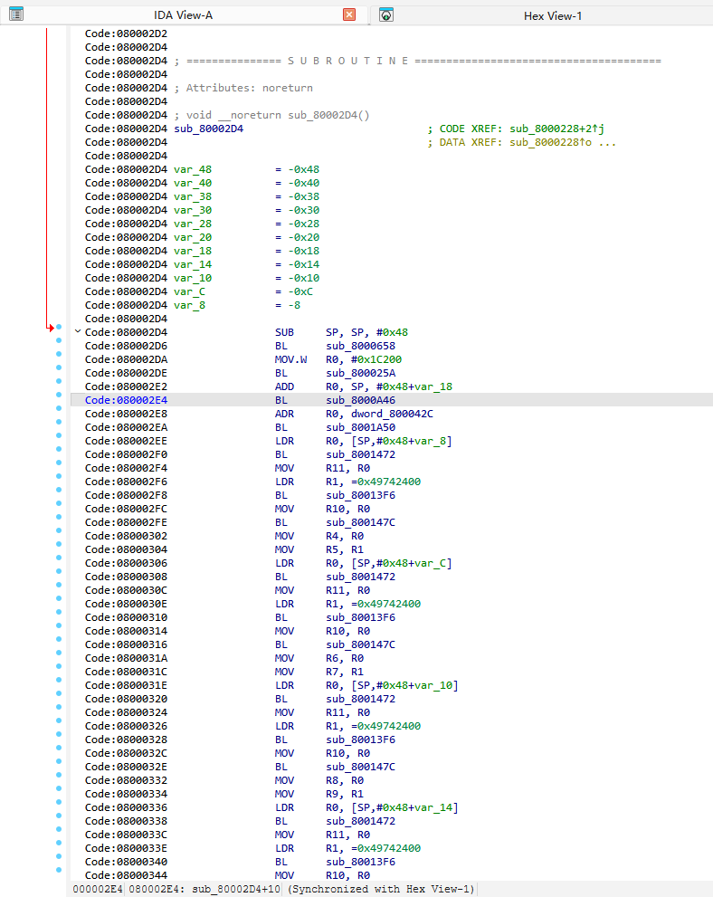

选中这里的汇编后，按F5可针对这段汇编生成伪C函数。

看到这段函数时，我竟汗流浃背。。。。

这与我烧录进的例程竟如此相似。。。

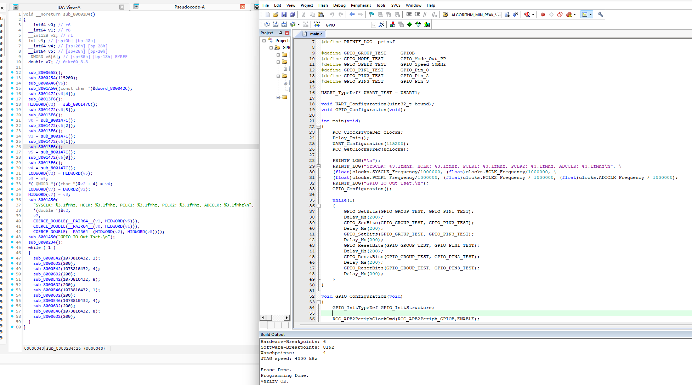

逆向工程经验的丰富的工程师，到这已经能如鱼得水的分析出程序的流程，甚至修改固件中的一些参数。

劳动成果是小，但从固件中暴露出来的一些核心算法，以及交互密钥等信息，确是重中之重。

## 四、小结

当然，能简单的被J-Link直接取出固件这事，在有大批量出货的设备上，略显抽象，一般出场都会简单的设置一下flash的防护等级，防止外部设备直接读取。

一些设备需要后续OTA等操作，只能设置RDP为Level 1，这并不是万能的，还是有很多方法可以绕过进行读取。

所以在软件上还需要验证固件是否被拷贝到其他MCU使用，还有要对存入flash中的重要参数进行加密；也可使用一些混淆工具，给逆向工程的大哥们制造些许困难。

这里我们也不求能完全防御住被破解的风险，只求我们的防御能给破解者制造足够多的困难，就可抵挡住绝大部分的工程师了。

所以，在这里再次对各位同仁们建议，别让程序裸奔。。。

本文非 AI 创作，如转载请注明出处。
