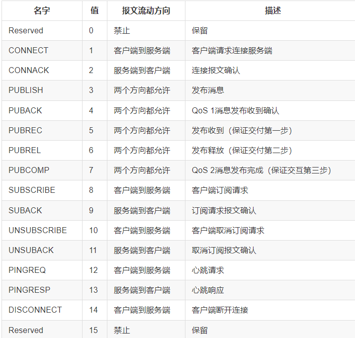
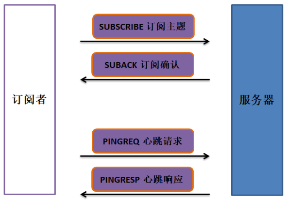
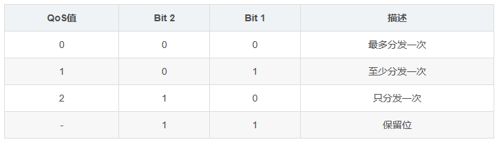
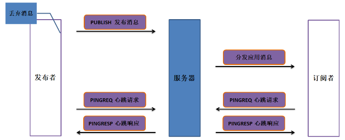
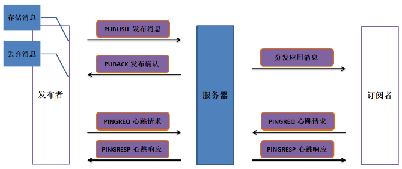
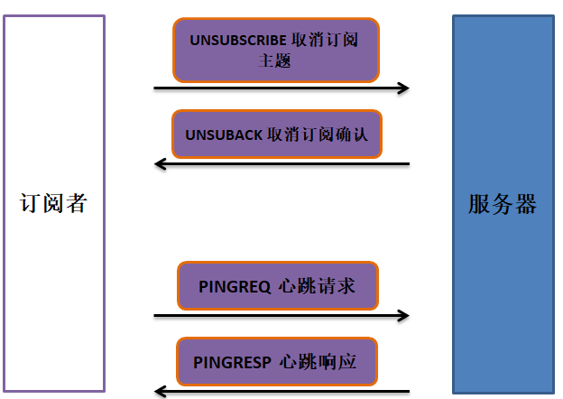
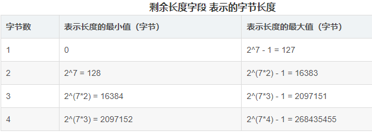
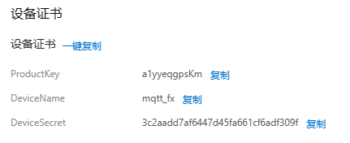

import { Aside } from 'astro-pure/user'

深度挖掘一下 MQTT。
中文文档：[https://mcxiaoke.gitbooks.io/mqtt-cn/content/](https://mcxiaoke.gitbooks.io/mqtt-cn/content/)
CSDN：[https://blog.csdn.net/qq_39785798/article/details/80765716](https://blog.csdn.net/qq_39785798/article/details/80765716)

消息队列遥测传输协议，是基于发布/订阅模式的“轻量级”通讯协议，该协议构建与 TCP/IP。
优点：可以以极少的代码和有限的带宽，为连接远程设备提供实时可靠的消息。作为一种低开销、低带宽占用的即时通讯协议，主要在物联网、小型设备、移动设备上应用。

> 根据中文文档协议说明，通过 AT 透传把相对应协议命令转化为 ASCII 码/16 进制在发送给服务端。
> 请求数据包解析：[https://blog.csdn.net/qq_29933439/article/details/91350987](https://blog.csdn.net/qq_29933439/article/details/91350987)

## 访问流程

[https://blog.csdn.net/jiejiemcu/article/details/106737995](https://blog.csdn.net/jiejiemcu/article/details/106737995)

> 首先 TCP 连接到服务器端口。

> 

以下发送的报文均为 16 进制 ASCII 码。

### MQTT 连接服务器

1. `客户端` CONNECT 连接请求。

   1. 第一个报文必须是 CONNECT 报文，且只能一次，否则违规。
2. `服务端` CONNACK 确认连接请求。

   1. 服务端返回的应答码。
3. 中间是正常的数据交互。
4. `客户端` PINGREQ 心跳请求。

   1. 隔一段时间（1 分钟左右）要有心跳请求，否则断开。
5. `服务端` PINGRESP 心跳响应。


### MQTT 订阅主题

1. `订阅者` SUBSCRIBE 订阅主题。

   1. 用于创建一个或多个订阅。
   2. 支持通配符，指定了最大 QoS 等级，有固定、可变报头和有效载荷。

      1. 这里的有效载荷包含了主题过滤列表，标识客户端想要订阅的主题，必须是 UTF-8 字符串。
2. `服务器` SUBACK 订阅确认。

   1. 必须和等待确认的 SUBSCRIBE 有相同的报文标识符。
3. ` 客户端``服务端 ` PINGREQ 心跳请求和 PINGRESP 响应不能断。



### MQTT 发布消息

> 服务质量等级 QoS
> 

#### QoS0 的 PUBLISH 控制报文

> 发布消息服务器不会发送响应，发布者也不会重试，发出消息就丢弃了，所以消息可能根本没到达。
> **发布者必须发送 QoS 等于 0，DUP 等于 0 的 PUBLISH 报文。**

- PUBLISH	发布消息 `发布者`



#### QoS1 的 PUBLISH 控制报文

> 确保消息至少送达一次，甚至可能被多次处理。QoS1 的 PUBLISH 报文的可变报头中包含一个报文标识符，需要 PUBACK 报文确认。
> 收到确认报文后丢弃消息。
> **发布者必须发送 QoS 等于 1，DUP 等于 0 的 PUBLISH 报文。**

- PUBLISH	发布消息 `发布者`
- PUBACK	发布确认 `服务端`



#### QoS2 的 PUBLISH 控制报文

> 这是最高等级的服务质量，消息丢失和重复都是不可接受的。使用这个服务质量等级会有额外的开销。
> **发布者必须发送 QoS 等于 2，DUP 等于 0 的 PUBLISH 报文。**

- PUBLISH		发布消息 `发布者`
- PUBREC		发布收到 `服务端`
- PUBREL 		发布释放 `发布者`
- PUBCOMP	发布完成 `服务端`


### 取消订阅

> UNSUBSCRIBE 报文固定报头的第 3,2,1,0 位是保留位且必须分别设置为 0,0,1,0。否则服务器必须认为任何其它的值都是不合法的并关闭网络连。具体的描述可以看协议文档。
> UNSUBSCRIBE 报文的有效载荷包含客户端想要取消订阅的主题过滤器列表。UNSUBSCRIBE 报文中的主题过滤器必须是连续打包的 UTF-8 编码字符串。

- UNSUBSCRIBE		取消订阅主题 `订阅者`
- UNSUBACK		取消订阅确认 `服务器`



### 断开连接

> DISCONNECT 报文是客户端发给服务端的最后一个控制报文。表示客户端正常断开连接。
> DISCONNECT 报文的固定报头保留位必须全为 0。
> 客户端发送 DISCONNECT 报文之后必须关闭网络连接，不能通过那个网络连接再发送任何控制报文。

- `订阅者` DISCONNECT		断开连接

# 报文案例

> 这里按照数据报文的规定，给了每个报文的例子。
> 当然实际使用要转化为 ASCII 的十六进制码。

#### CONNECT-连接服务端

> 10 + 剩余的长度 + 00 04(协议名长度) + 4d 51 54 54(MQTT) + 04(协议版本) + 连接标志 + 00 3c(心跳间隔) + 客户端 ID 长度 2 字节 + 客户端 ID + 用户名长度 2 字节 + 用户名 + 密码长度 2 字节 + 密码

这里有效载荷顺序必须是：客户端标识符，遗嘱主题，遗嘱消息，用户名，密码。
载荷的东西就根据连接标志里面 1 定义，比如上面的例子是在连接标志里面定义了用户名和密码。
剩余长度字段使用一个变长度编码方案，对小于 128 的值它使用单字节编码。更大的值按下面的方式处理。低 7 位有效位用于编码数据，最高有效位用于指示是否有更多的字节。因此每个字节可以编码 128 个数值和一个_延续位（continuation bit）_。剩余长度字段最大 4 个字节。

> [https://blog.csdn.net/Mark_md/article/details/108196317](https://blog.csdn.net/Mark_md/article/details/108196317)
> 这个计算是要有点门道。
> 大概就是把数值转化为二进制，在进行拆分填入
> 




#### PINGREQ-心跳请求

> 固定报文:    C0 00

这个要在 CONNECT 规定的保持连接 Keep Alive 的秒数之内发送心跳就行。

#### DISCONNECT-断开连接

> 固定报文：E0 00

#### SUBSCRIBE_订阅主题

> 82(固定报头) + 剩余长度 + 可变报头 2 字节(相当于用户 ID，自定义) + Topic 长度两字节 + Topic + 服务等级(0->00，1->01)

剩余长度 = 可变 + 负载。

> 可变报头建议顺序增加从 0001 到 ffff。
> 这个是关键，相当于订阅设备自己的 ID，不要重复。

#### UNSUBSCRIBE_取消订阅

> A2(固定报头) + 剩余长度 + 可变报头 2 字节(相当于用户 ID，自定义) + Topic 长度两字节 + Topic

和订阅主题就差别在：

- 固定报头改了报文类型
- 结尾没有服务等级。

#### PUBLISH_数据上报

> 30(MQTT 报文类型 +DUP+QoS-H+QoS-+RETAIN) + 剩余长度 + 发布的 Topic 名字长度两字节 + 发布 Topic + 载荷数据
> 上面的 30 中 QoS 等级为 0，等级为 1 是 32

> 例子：用阿里云在线调试发布的消息，很随便
> 30 9D 01 00 33 2F 73 79 73 2F 61 31 79 79 65 71 67 70 73 4B 6D 2F 6D 71 74 74 5F 66 78 2F 74 68 69 6E 67 2F 73 65 72 76 69 63 65 2F 70 72 6F 70 65 72 74 79 2F 73 65 74 7B 22 6D 65 74 68 6F 64 22 3A 22 74 68 69 6E 67 2E 73 65 72 76 69 63 65 2E 70 72 6F 70 65 72 74 79 2E 73 65 74 22 2C 22 69 64 22 3A 22 33 34 34 34 36 31 37 31 22 2C 22 70 61 72 61 6D 73 22 3A 7B 22 74 65 6D 70 22 3A 38 38 2C 22 68 75 6D 69 22 3A 37 37 7D 2C 22 76 65 72 73 69 6F 6E 22 3A 22 31 2E 30 2E 30 22 7D
> 例子去掉前面的 30 9D 01 00 33 的数据为：
>
> - /sys/a1yyeqgpsKm/mqtt_fx/thing/service/property/set{"method":"thing.service.property.set","id":"34446171","params":{"temp":88,"humi":77},"version":"1.0.0"}

以下是针对阿里云：

- 要有请求方法	method + Topic
- 设备唯一标识	id + 自定义 ID
- 业务属性参数	属性 1 + 参数，属性 2……
- 协议版本号	version + 版本号

上面的 QoS 等级为 0，就是没有任何响应的。

如果要有响应，就把固定报头加上 QoS 等级 1，为 32，格式中还要在 Topic 后面加上报文标识符两个字节。

# 阿里云

> CSDN 的连接教程：[https://blog.csdn.net/fang_dz999/article/details/112283742](https://blog.csdn.net/fang_dz999/article/details/112283742)
> 阿里云的帮助手册：[https://help.aliyun.com/zh/iot/user-guide/device-properties-events-and-services?spm=a2c4g.11186623.0.0.598577e11gleH5](https://help.aliyun.com/zh/iot/user-guide/device-properties-events-and-services?spm=a2c4g.11186623.0.0.598577e11gleH5)

只支持 0 和 1 的服务等级。

a1yyeqgpsKm.iot-as-mqtt.cn-shanghai.aliyuncs.com :1883   主机地址

#### 参数（以阿里手册为主）

首先设备三元组是这个：

{   "ProductKey": "a1yyeqgpsKm",   "DeviceName": "mqtt_fx",   "DeviceSecret": "3c2aadd7af6447d45fa661cf6adf309f" }



1. 客户端 ID

   1. *|securemode=2,signmethod=hmacsha256|

      1. *表示设备名称，注意替换
2. 客户端 ID

   1. 产品名 + & + 设备的 ProductKey
3. 密码（明文格式可能会变，看看平台的说明）

   1. 设计到加密协议：HmacSHA1
   2. 找一下加密网站，用 DeviceSecret 作为密钥进行明文加密：clientld+ 设备名 +deviceName+ 设备名 +productKey+ 设备的密钥
4. 地址      端口 1883

   1. *.iot-as-mqtt.cn-shanghai.aliyuncs.com

      1. *表示自己账号的 ProductKey，注意替换。

#### 自己编写一波

```markdown
- 服务器：a1yyeqgpsKm.iot-as-mqtt.cn-shanghai.aliyuncs.com
- username_用户名：mqtt_fx&a1yyeqgpsKm

下面这密码是加密过的
- passwd：c86c95ef56cceaaa6a8334ef090d6d5c5fa07ca6eac25b0872806188adbad420
- clientID_客户端ID：a1yyeqgpsKm.mqtt_fx|securemode=2,signmethod=hmacsha256,timestamp=1691648594041|
- 发布和订阅： /a1yyeqgpsKm/${deviceName}/user/STM32F103C8T6

- 属性上报：	thing.event.property.post
- 属性设置：	thing.service.property.set
- 设备发布topic：	/sys/a1yyeqgpsKm/mqtt_fx/thing/event/property/post
- 测试发布的数据：{"method":"thing.event.property.post","id":"23123123","params":{"temp":63 ,"humi":36},"version":"1.0.0"}

# CONNECT 连接客户端
10 b2 01 00 04 4d 51 54 54 04 c2 00 3c 00 4f 61 31 79 79 65 71 67 70 73 4B 6D 2E 6D 71 74 74 5F 66 78 7C 73 65 63 75 72 65 6D 6F 64 65 3D 32 2C 73 69 67 6E 6D 65 74 68 6F 64 3D 68 6D 61 63 73 68 61 32 35 36 2C 74 69 6D 65 73 74 61 6D 70 3D 31 36 39 31 36 34 38 35 39 34 30 34 31 7C 00 13 6D 71 74 74 5F 66 78 26 61 31 79 79 65 71 67 70 73 4B 6D 00 40 63 38 36 63 39 35 65 66 35 36 63 63 65 61 61 61 36 61 38 33 33 34 65 66 30 39 30 64 36 64 35 63 35 66 61 30 37 63 61 36 65 61 63 32 35 62 30 38 37 32 38 30 36 31 38 38 61 64 62 61 64 34 32 30

# CONNACK 确认连接请求
20 02 00 00

# PINGREQ 心跳请求
C0 00
> 尾巴 00->连接接受  01->连接拒绝，不支持协议版本  02->连接拒绝，不合格的客户端标识符
> 03->连接拒绝，服务端不可用 04->连接拒绝,无效的用户名或密码 05->连接拒绝，未授权

# PINGRESP 心跳响应
D0 00

# DISCONNECT 断开连接
E0 00

# SUBSCRIBE 订阅主题
82 38 00 0A 00 33 2F 73 79 73 2F 61 31 79 79 65 71 67 70 73 4B 6D 2F 6D 71 74 74 5F 66 78 2F 74 68 69 6E 67 2F 73 65 72 76 69 63 65 2F 70 72 6F 70 65 72 74 79 2F 73 65 74 00

# SUBACK 订阅确认
90 03 00 0A 01
> 中间的 00 0A 是订阅主题的报文标识符，用来表示是回复给订阅主题的 00 0A 设备。
> 这里尾巴有的讲。 00->最大QoS 0.  01->成功，最大QoS1.  02->成功，最大QoS2. 80->失败。
> # 阿里云比较特殊确认回复的全是01。 #

# UNSUBSCRIBE 取消订阅
A2 37 00 0A 00 33 2F 73 79 73 2F 61 31 79 79 65 71 67 70 73 4B 6D 2F 6D 71 74 74 5F 66 78 2F 74 68 69 6E 67 2F 73 65 72 76 69 63 65 2F 70 72 6F 70 65 72 74 79 2F 73 65 74

# UNSUBACK 取消订阅确认
B0 02 00 0A
> 00 0A 是订阅主题的报文标识符，用来表示是取消订阅主题的 00 0A 设备。
> 02 剩余长度

# PUBLISH 发布消息
30 9D 01 00 33 2F 73 79 73 2F 61 31 79 79 65 71 67 70 73 4B 6D 2F 6D 71 74 74 5F 66 78 2F 74 68 69 6E 67 2F 73 65 72 76 69 63 65 2F 70 72 6F 70 65 72 74 79 2F 73 65 74 7B 22 6D 65 74 68 6F 64 22 3A 22 74 68 69 6E 67 2E 73 65 72 76 69 63 65 2E 70 72 6F 70 65 72 74 79 2E 73 65 74 22 2C 22 69 64 22 3A 22 33 34 34 34 36 31 37 31 22 2C 22 70 61 72 61 6D 73 22 3A 7B 22 74 65 6D 70 22 3A 38 38 2C 22 68 75 6D 69 22 3A 37 37 7D 2C 22 76 65 72 73 69 6F 6E 22 3A 22 31 2E 30 2E 30 22 7D 
> 这里发布的是QoS为0的消息，没有确认

# PUBACK 发布确认
40 02 7B 22 
> 40 固定报头，02 为接下来剩余长度固定为2，7b 22 发布消息的报文标识符（标识符必须是2个字节）
```

#### 上传格式

上传格式：

- id：String\每个设备的唯一 ID，自定义。
- params：Object\请求业务的参数，里面是一些属性和数值。
- version：String\协议版本号，目前协议版本号唯一值为 `1.0`。
- method：String\请求方法。
  - 发布属性：thing.event.property.post

```json
{"id":自定义设备唯一ID, 
	"params":{
		"物模型属性名1":数据,
		"物模型属性名2":数据
	},
	"version":"1.0",
	"method":"thing.event.property.post"
}
```

‍
